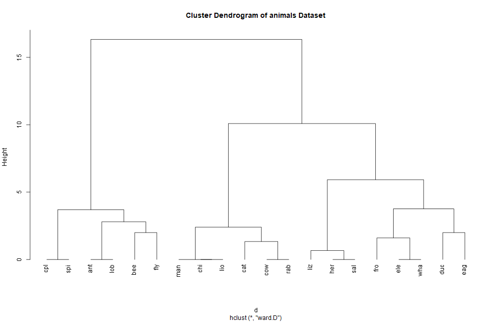

# cluster_lab
cluster_lab

## Work1

## Work2
The generated clusters:

Images of different parameters(standardization, metric):

Clara methods using the manhattan and euclidean meric with standardization have the least intra-cluster sum of squares and are the best. Since each data is stretched in a certain dimension, in order to offset the interference caused by this stretch, the interference can be offset by using data standardization to restore the data to a standard distribution. Therefore we use the standardized keams algorithm to get the best results.

## Work3
I used Ward clusterization method with euclidean distance for this work:

Here's a dendrogram showing similarities between states clustered by how much they voted Republican in the election. The clustering results show that the 50 states have very similar voting trends in the elections. By looking at the dendrogram, we can see some trends and patterns in the election results and gain a better understanding of the cluster structure in the data.

## Work4
I use Ward clusterization method with manhattan distance for this work:

This method classifies some species such as insects, birds, and mammals at the lower end, but in the upper categories, there is still a lot of confusion.

## Work5
